
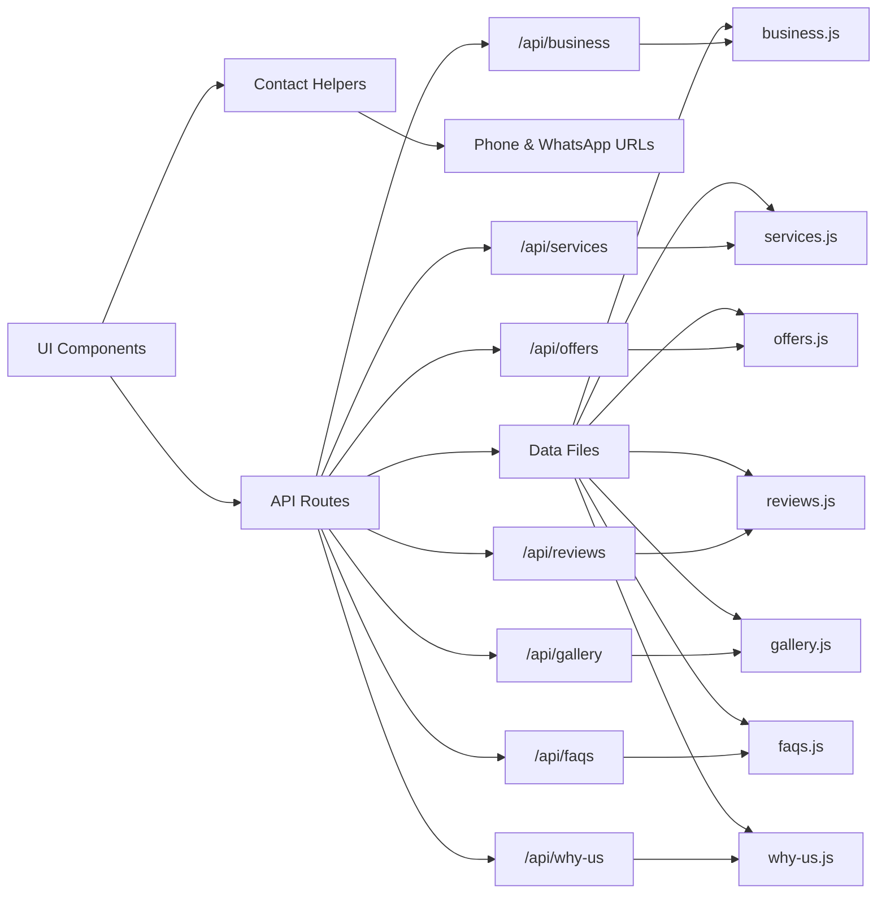
```mermaid
flowchart TD
    A["app/"] --> B["components/"]
    A --> C["data/"]
    A --> D["lib/"]
    A --> E["api/"]
    A --> F["page.js"]
    A --> G["layout.js"]
    A --> H["globals.css"]

    B --> B1["home/"]
    B --> B2["ui/"]

    B1 --> B3["Navbar"]
    B1 --> B4["HeroSection"]
    B1 --> B5["SpecialOffers"]
    B1 --> B6["ServicesMenu"]
    B1 --> B7["FAQ"]
    B1 --> B8["WhyChooseUs"]
    B1 --> B9["Gallery"]
    B1 --> B10["Testimonials"]
    B1 --> B11["LocationMap"]
    B1 --> B12["FinalCTA"]
    B1 --> B13["MobileBookingBar"]

    B2 --> B14["Brand & Social Icons"]

    C --> C1["business.js"]
    C --> C2["services.js"]
    C --> C3["offers.js"]
    C --> C4["reviews.js"]
    C --> C5["gallery.js"]
    C --> C6["faqs.js"]
    C --> C7["why-us.js"]

    D --> D1["contact.js"]

    E --> E1["business/"]
    E --> E2["services/"]
    E --> E3["offers/"]
    E --> E4["reviews/"]
    E --> E5["gallery/"]
    E --> E6["faqs/"]
    E --> E7["why-us/"]
```

# Aaira Khan Salon & Studio

A modern, responsive web experience for Aaira Khan Salon & Studio, Karachi, built to present salon services, beauty offerings, promotions, gallery work, customer reviews, FAQs, location information, and direct booking channels through a polished and accessible interface.

**Live Website:** https://aaira-khan-salon.vercel.app/

## Table of Contents

- [Overview](#overview)
- [Preview and Live Demo](#preview-and-live-demo)
- [Features](#features)
- [Tech Stack](#tech-stack)
- [Architecture](#architecture)
- [Project Structure](#project-structure)
- [Data Architecture](#data-architecture)
- [SEO](#seo)
- [Responsive Experience](#responsive-experience)
- [Contact & Booking](#contact--booking)
- [Getting Started](#getting-started)
- [Deployment](#deployment)
- [Author](#author)

## Overview

The website brings the salon's key information and customer-facing actions into a single experience, with a structure focused on service discovery, trust, and appointment conversion.

The main content flow is:

**Discover → Explore Services → View Work → Read Reviews → Find Location → Book**

## Preview and Live Demo

Click the preview to visit the live page 👇

### Responsive Views

- [Tablet](public/images/aaira-khan-salon-tab.png)
- [Mobile](public/images/aaira-khan-salon-mob.png)

## Features

- Responsive landing page across mobile, tablet, and desktop
- Sticky navigation with section-based navigation
- Mobile navigation menu
- Mobile booking bar
- Hero section with direct booking actions
- Promotional offers
- Service catalog
- FAQ accordion
- Why Choose Us section
- Responsive image gallery
- Customer testimonials
- Google Maps location section
- Phone and WhatsApp contact actions
- Social media integration
- Reusable brand and social SVG icons
- Contextual WhatsApp inquiry messages
- Centralized business information
- Accessible interactive controls
- Responsive typography and spacing
- Lazy-loaded gallery imagery
- Local business structured data
- SEO metadata

## Tech Stack

- Next.js
- React
- JavaScript
- Tailwind CSS
- Next Font
- Material Symbols
- Schema.org JSON-LD
- Google Maps
- WhatsApp
- Git & GitHub

## Architecture

## Project Structure

## Data Architecture

The project separates content data, API access, and presentation logic to keep the application organized and maintainable.

### Centralized Business Configuration

Core business information is maintained in:
`app/data/business.js`

It contains the salon's:

- Business name
- Address
- Location label
- Phone number
- WhatsApp number
- Booking message
- Opening hours
- Google Maps information
- Coordinates
- Social profiles

Contact URL generation is handled separately through:

`app/lib/contact.js`

This provides reusable helpers for phone and WhatsApp actions without duplicating contact URL logic across components.

### Content Data

Customer-facing content is organized into dedicated data files inside:

`app/data/`

- `services.js`
- `offers.js`
- `reviews.js`
- `gallery.js`
- `faqs.js`
- `why-us.js`
- `business.js`

### API Layer

Dedicated Next.js API routes expose the data to the client components:

- `/api/business`
- `/api/services`
- `/api/offers`
- `/api/reviews`
- `/api/gallery`
- `/api/faqs`
- `/api/why-us`

The API layer keeps data access separate from the presentation layer. Components fetch the required content through these endpoints instead of embedding the content directly inside the UI components.

### Data Flow

The overall flow is:

**Data Files → API Routes → UI Components → Rendered Sections**

This separation makes the content easier to update while keeping the presentation components focused on rendering and interaction.

## SEO

The site uses the Next.js Metadata API alongside structured data to establish a clear search-engine representation of the business.

Implemented SEO elements include:

- Descriptive page metadata
- Open Graph metadata
- Descriptive image alternative text
- Local business information
- `BeautySalon` structured data
- Business address and location coordinates
- Telephone information
- Opening hours

The structured data is generated from the centralized business configuration so the salon's core information remains consistent between the interface and search metadata.

## Responsive Experience

The interface adapts across mobile, tablet, and desktop layouts.

Responsive behavior includes:

- Desktop and mobile navigation patterns
- Mobile-specific booking actions
- Flexible service layouts
- Adaptive gallery grids
- Responsive typography
- Touch-friendly controls
- Flexible spacing and content widths
- Mobile-first contact actions

The visual system uses consistent spacing, typography, borders, surfaces, and interaction states throughout the experience.

## Contact & Booking

The website provides direct communication through:

- WhatsApp
- Phone
- Google Maps directions
- Instagram
- Facebook
- YouTube
- TikTok

Booking actions use the centralized contact helpers, while service-specific actions can generate contextual WhatsApp messages.

For example, a service inquiry can open WhatsApp with the selected service already included in the message.

## Getting Started

### Installation

`git clone https://github.com/hadiashah01/aaira-khan-salon.git`

`cd aaira-khan-salon`

`npm install`

### Development

`npm run dev`

The application runs locally at:

`http://localhost:3000`

### Production Build

`npm run build`

### Production Server

`npm start`

## Deployment

The application is deployed as a live Next.js web experience.

**Live Website:**  
https://aaira-khan-salon.vercel.app/

## Author

### Hadia Shahjahan

- **GitHub:** https://github.com/hadiashah01
- **LinkedIn:** https://www.linkedin.com/in/hadia-shahjahan
